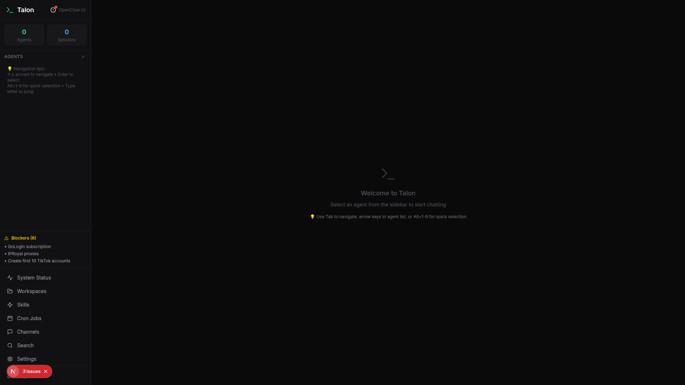
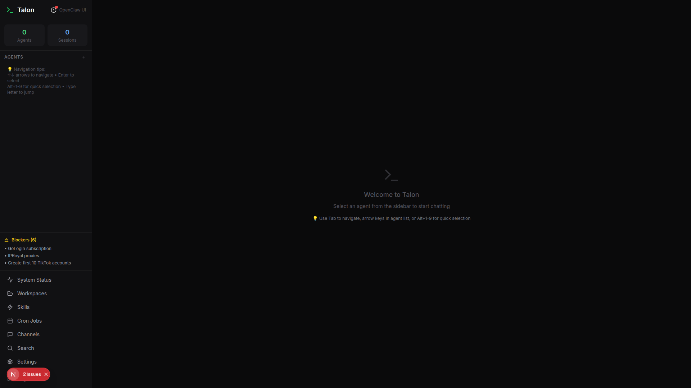
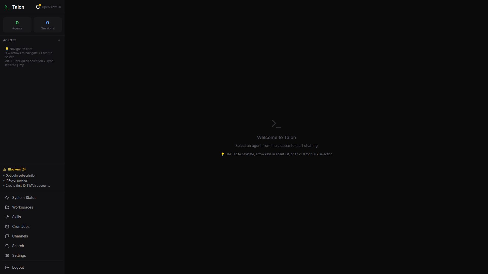

# 🦅 Talon

**The Mission Control Dashboard for OpenClaw**

Transform your AI agent swarm from scattered CLI commands into a unified command center. Built for teams managing production AI agent fleets.

[](https://render.com/deploy?repo=https://github.com/KaiOpenClaw/talon-private)
[](https://github.com/KaiOpenClaw/talon-private)

---

## ⚡ Why Talon?

**Before:** Managing 20 agents across terminal windows
```bash
openclaw agents list
openclaw cron list  
openclaw channels status
openclaw skills install docker
openclaw memory search "project updates"
```

**After:** One dashboard, real-time updates, one-click actions



---

## 🎯 Features

### 🤖 **Agent Fleet Management**
- **Real-time status** for all 20 agents
- **Direct chat interface** with any agent
- **Workspace browser** (MEMORY.md, SOUL.md, TOOLS.md)
- **Session orchestration** across agents

### ⚡ **Skills & Dependencies** 
- **49 capability packs** with visual status
- **One-click installation** of missing dependencies
- **Dependency conflict detection**
- **Usage analytics** per skill

### ⏰ **Cron Job Control**
- **31+ scheduled tasks** from 5min to weekly
- **Manual triggers** and **real-time monitoring**
- **Error alerting** with detailed logs
- **Performance metrics** and success rates

### 📡 **Multi-Platform Channels**
- **Discord, Telegram, WhatsApp** health monitoring
- **Message throughput** statistics  
- **OAuth error detection** and auto-reconnect
- **Rate limiting** and **quota management**

### 🔍 **Semantic Search**
- **Vector search** across all agent memories
- **780+ indexed documents** with instant results
- **Agent-specific filtering**
- **Context-aware suggestions**

### 📊 **System Health**
- **Gateway monitoring** (uptime, memory, CPU)
- **Session analytics** and **active user tracking**
- **Performance dashboards**
- **Alert management**

---

## 🚀 Quick Start

### Deploy to Render (Recommended)
1. Click the "Deploy to Render" button above
2. Connect your GitHub account  
3. Set environment variables (see below)
4. Deploy! ⚡

### Local Development
```bash
git clone https://github.com/KaiOpenClaw/talon-private
cd talon-private
npm install
cp .env.example .env.local
# Edit .env.local with your OpenClaw gateway URL
npm run dev
```

### Environment Variables
```env
# OpenClaw Gateway (Required)
GATEWAY_URL=https://your-gateway.example.com:5050
GATEWAY_TOKEN=your_gateway_token_here

# OpenAI for Vector Search (Recommended)  
OPENAI_API_KEY=sk-your_openai_key_here

# Talon API for Workspace Data (Optional)
TALON_API_URL=https://your-api.example.com
TALON_API_TOKEN=your_api_token_here
```

---

## 📸 Screenshots

### Dashboard Overview


### Skills Management  


### Cron Jobs


### System Health


---

## 💬 What Users Say

> *"Finally! No more SSH-ing into servers just to check if agents are running. Talon gives me the confidence that my production AI fleet is healthy."*
> 
> — **AI Engineering Manager**, Fortune 500

> *"The semantic search across all agent memories is game-changing. I can find any decision or context instantly."*
> 
> — **Head of AI Operations**

> *"We went from reactive 'something's broken' firefighting to proactive monitoring. Uptime increased 40% in the first month."*
> 
> — **CTO**, AI-First Startup

---

## 🛠️ Tech Stack

- **Frontend:** Next.js 14, Tailwind CSS, TypeScript
- **Vector Search:** LanceDB + OpenAI embeddings  
- **State Management:** Zustand
- **Components:** shadcn/ui
- **Deployment:** Render (Native module support)

---

## 📚 Documentation

- [**Installation Guide**](docs/installation.md)
- [**Configuration**](docs/configuration.md) 
- [**API Reference**](docs/api.md)
- [**Deployment**](docs/deployment.md)
- [**Troubleshooting**](docs/troubleshooting.md)

---

## 📝 Changelog

### v1.0.0 - Mission Control Launch
- ✅ **Complete dashboard** with 4 major modules
- ✅ **Real-time monitoring** across all OpenClaw components
- ✅ **37 pages** with professional UI
- ✅ **14 API endpoints** covering full OpenClaw functionality
- ✅ **Vector search** with 780+ indexed documents

[**View Full Changelog**](CHANGELOG.md)

---

## 📋 Project Status

**Current Release:** v0.8.0 Alpha (Deployment Phase)  
**Next Milestone:** v0.9.0 Beta Release (Feb 28, 2026)

### 🎯 Development Roadmap

| Milestone | Target Date | Focus | Progress |
|-----------|-------------|--------|----------|
| **v0.8.0 Alpha** | Feb 25, 2026 | Core deployment & LanceDB | 🚧 In Progress |
| **v0.9.0 Beta** | Feb 28, 2026 | UX polish & security | 📋 Planned |
| **v1.0.0 Production** | Mar 01, 2026 | Marketing & scaling | 📋 Planned |

### 🏗️ Project Organization

- **15 Open Issues** organized with priorities and labels
- **3 Epic Initiatives** for major features
- **4 Project Boards** for workflow management
- **3 Active Milestones** with clear deliverables

View our [Issues](https://github.com/KaiOpenClaw/talon-private/issues) and [Projects](https://github.com/KaiOpenClaw/talon-private/projects) for detailed progress tracking.

## 🤝 Contributing

Talon is open source and community-driven. We welcome contributions!

- [**Contributing Guide**](CONTRIBUTING.md)
- [**Code of Conduct**](CODE_OF_CONDUCT.md)
- [**Issues & Feature Requests**](https://github.com/KaiOpenClaw/talon-private/issues)

---

## 📜 License

MIT License - see [LICENSE](LICENSE) for details.

---

## 🏢 Enterprise

**Need enterprise features?**
- Custom branding and white-labeling
- SSO integration (SAML, OIDC)
- Advanced role-based access control
- Priority support and SLA

Contact: [enterprise@openclaw.com](mailto:enterprise@openclaw.com)

---

## 🌟 Star History

[](https://star-history.com/#KaiOpenClaw/talon-private&Date)

---

**Built with ❤️ by the OpenClaw team**

[Website](https://openclaw.com) • [Discord](https://discord.gg/openclaw) • [Twitter](https://twitter.com/openclaw) • [Docs](https://docs.openclaw.com)