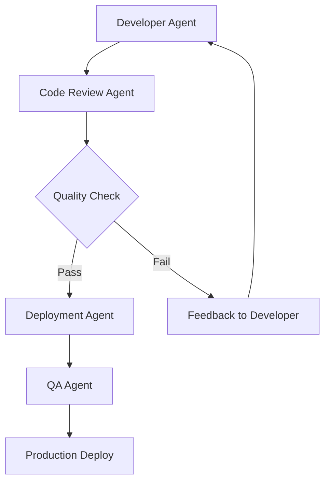

# Advanced Agent Management with Talon

*Master multi-agent orchestration, session management, and workflow optimization for production OpenClaw deployments.*


## Beyond Single Agent Workflows

Once you've mastered basic Talon usage, the real power emerges in coordinating multiple specialized agents. This guide covers advanced patterns for managing complex agent ecosystems efficiently.

## Multi-Agent Architecture Patterns

### 1. Specialized Agent Roles

Organize your agents by function rather than treating them as general-purpose tools:

**Development Team Pattern:**
- **Architect Agent**: High-level design and system planning
- **Backend Developer**: API and database implementation  
- **Frontend Developer**: UI/UX and client-side code
- **QA Agent**: Testing, code review, and quality assurance
- **DevOps Agent**: Deployment, monitoring, and infrastructure

**Content Creation Pipeline:**
- **Research Agent**: Information gathering and analysis
- **Writer Agent**: Content creation and editing
- **SEO Agent**: Optimization and keyword strategy
- **Social Media Agent**: Distribution and engagement
- **Analytics Agent**: Performance tracking and insights

### 2. Hierarchical Agent Management

Structure agents in hierarchies for complex projects:

```
Project Manager Agent
├── Research Team Lead
│   ├── Market Research Agent
│   ├── Technical Research Agent  
│   └── Competitor Analysis Agent
├── Development Team Lead
│   ├── Backend Development Agent
│   ├── Frontend Development Agent
│   └── Mobile Development Agent
└── Marketing Team Lead
    ├── Content Creation Agent
    ├── Social Media Agent
    └── Email Marketing Agent
```

### 3. Event-Driven Coordination

Use Talon's cron system to create agent coordination workflows:

```yaml
# Example: Daily development sprint coordination
schedule: "0 9 * * 1-5"  # Weekdays at 9 AM
workflow:
  1. Project Manager reviews overnight progress
  2. Architect Agent updates technical requirements  
  3. Development agents receive daily assignments
  4. QA Agent prepares test scenarios
  5. DevOps Agent checks deployment readiness
```

## Session Management Best Practices

### Session Lifecycle Management

Talon provides powerful session controls for managing agent interactions:

#### 1. Session Naming Conventions

Establish clear naming patterns for easy identification:

```
Format: [agent-type]-[project]-[task]-[YYYY-MM-DD]

Examples:
- backend-ecommerce-payment-api-2026-02-18
- content-blog-seo-optimization-2026-02-18  
- qa-mobile-regression-testing-2026-02-18
```

#### 2. Session Tagging and Organization

Use Talon's workspace features to organize sessions:

**By Project:**
- Group related sessions in project workspaces
- Use consistent tagging for cross-references
- Maintain session dependencies and relationships

**By Priority:**
- Critical: Production issues and blockers
- High: Current sprint work
- Medium: Next sprint preparation  
- Low: Research and exploration

**By Status:**
- Active: Currently in progress
- Blocked: Waiting on dependencies
- Review: Ready for evaluation
- Complete: Finished and documented

### 3. Session Spawning Strategies

Leverage Talon's session spawning for parallel work:

#### Parallel Development Pattern
```javascript
// Spawn related tasks simultaneously
const sessions = await Promise.all([
  spawnSession('backend-dev', 'Implement user authentication'),
  spawnSession('frontend-dev', 'Build login UI components'),  
  spawnSession('qa-agent', 'Prepare auth testing scenarios'),
  spawnSession('docs-agent', 'Update authentication documentation')
]);
```

#### Sequential Workflow Pattern
```javascript
// Chain dependent tasks
const designSession = await spawnSession('architect', 'Design payment system');
await waitForCompletion(designSession);

const implementSession = await spawnSession('backend-dev', 
  'Implement payment system based on ' + designSession.output);
await waitForCompletion(implementSession);

const testSession = await spawnSession('qa-agent',
  'Test payment system implementation');
```

## Workspace Organization

### Folder Structure Best Practices

Organize agent workspaces for maximum efficiency:

```
agents/
├── core/                    # Essential system agents
│   ├── project-manager/
│   ├── architect/
│   └── system-monitor/
├── development/            # Development team agents  
│   ├── backend-dev/
│   ├── frontend-dev/
│   ├── mobile-dev/
│   └── devops/
├── content/               # Content creation team
│   ├── researcher/
│   ├── writer/
│   ├── editor/
│   └── social-media/
└── specialized/           # Domain-specific agents
    ├── data-analyst/
    ├── security-auditor/
    └── performance-optimizer/
```

### Memory Management Strategies

#### 1. Shared Context Patterns

Use shared memory files for team coordination:

```markdown
# project-context/SHARED_MEMORY.md
## Current Sprint Goals
- [ ] User authentication system
- [ ] Payment processing integration
- [ ] Mobile app beta release

## Key Decisions
- Architecture: Microservices with Node.js
- Database: PostgreSQL with Redis caching
- Frontend: React with TypeScript

## Blockers & Dependencies
- Payment provider API testing environment needed
- Mobile build pipeline configuration pending
```

#### 2. Agent Handoff Protocols

Establish clear handoff procedures between agents:

```markdown
# HANDOFF_TEMPLATE.md
## From: [Previous Agent]
## To: [Next Agent]  
## Task: [Description]

### Context Summary
- What was completed
- Key decisions made
- Resources created

### Next Steps
- Immediate actions required
- Dependencies to consider
- Success criteria

### Resources
- Relevant files and documentation
- External references
- Contact information
```

## Performance Optimization

### 1. Session Resource Management

Monitor and optimize agent resource usage:

#### Memory Usage Patterns
```bash
# Check agent memory consumption
curl -H "Authorization: Bearer $GATEWAY_TOKEN" \
  https://your-gateway/api/agents/stats

# Optimize by:
- Closing idle sessions
- Archiving old conversations  
- Clearing temporary files
- Compacting memory databases
```

#### Token Usage Optimization
```javascript
// Strategies for token efficiency
const optimizedPrompt = {
  context: 'minimal',        // Only essential context
  history: 'last_10',       // Limit conversation history
  memory: 'relevant_only',  // Filter memory content
  format: 'structured'      // Use consistent formats
};
```

### 2. Caching Strategies

Implement intelligent caching for repeated tasks:

```yaml
# Cache frequently requested information
cache_patterns:
  code_reviews: 1_hour
  documentation: 4_hours  
  research_data: 24_hours
  system_status: 5_minutes
```

### 3. Load Balancing

Distribute work across agents effectively:

```javascript
// Agent workload balancing
const assignTask = (task) => {
  const availableAgents = getAgentsByType(task.type)
    .filter(agent => agent.status === 'idle')
    .sort((a, b) => a.currentLoad - b.currentLoad);
    
  return availableAgents[0] || queueTask(task);
};
```

## Monitoring and Analytics

### Real-time Dashboard Setup

Configure Talon dashboards for team oversight:

#### 1. Team Performance Metrics
- Tasks completed per agent per day
- Average response times by agent type
- Success rates for different task categories
- Resource utilization trends

#### 2. Project Progress Tracking  
- Sprint burn-down charts
- Milestone completion rates
- Blocked task identification
- Dependencies visualization

#### 3. Quality Metrics
- Code review feedback scores
- Bug detection rates
- Documentation completeness
- Test coverage improvements

### Health Monitoring

Set up proactive monitoring for agent ecosystem health:

```yaml
# Health check configuration
monitoring:
  agent_responsiveness: 30s
  memory_usage_threshold: 80%
  session_timeout: 10m
  error_rate_threshold: 5%
  
alerts:
  high_memory_usage:
    action: scale_down_sessions
    notification: team_lead
  agent_unresponsive:
    action: restart_agent
    notification: devops_team
```

## Advanced Workflow Patterns

### 1. Review and Approval Workflows

Implement quality gates with agent reviews:



### 2. Iterative Improvement Loops

Create self-improving agent workflows:

```javascript
const iterativeWorkflow = async (task, maxIterations = 3) => {
  let result = await initialImplementation(task);
  
  for (let i = 0; i < maxIterations; i++) {
    const feedback = await reviewAgent.analyze(result);
    
    if (feedback.quality >= QUALITY_THRESHOLD) {
      break;
    }
    
    result = await improvementAgent.enhance(result, feedback);
  }
  
  return result;
};
```

### 3. Cross-Agent Learning

Enable agents to learn from each other's experiences:

```yaml
# Learning configuration
knowledge_sharing:
  success_patterns:
    - Share successful approaches across similar agents
    - Update best practices documentation
    - Create reusable templates
    
  failure_analysis:
    - Document failure modes and solutions
    - Update agent training data
    - Improve error handling
```

## Security Considerations

### Agent Access Controls

Implement proper security boundaries:

```yaml
# Access control configuration  
agent_permissions:
  development_agents:
    - read: code_repositories
    - write: feature_branches
    - deploy: staging_environment
    
  production_agents:
    - read: production_logs
    - write: deployment_records
    - deploy: production_environment
    - require: manual_approval
```

### Audit and Compliance

Maintain audit trails for agent activities:

```javascript
// Audit logging
const auditLog = {
  agent_id: 'backend-dev-001',
  action: 'code_deployment',
  timestamp: '2026-02-18T13:30:00Z',
  resources: ['user-auth-service'],
  outcome: 'success',
  reviewer: 'qa-agent-001'
};
```

## Troubleshooting Multi-Agent Issues

### Common Problems and Solutions

#### 1. Agent Conflicts
**Problem**: Multiple agents modifying the same resources
**Solution**: Implement resource locking and coordination

```javascript
// Resource coordination
const lockResource = async (resourceId, agentId) => {
  const lock = await acquireLock(resourceId, agentId);
  if (!lock) {
    throw new Error(`Resource ${resourceId} locked by another agent`);
  }
  return lock;
};
```

#### 2. Session Deadlocks
**Problem**: Agents waiting indefinitely for each other
**Solution**: Implement timeouts and circuit breakers

```javascript
// Circuit breaker pattern
const executeWithTimeout = async (operation, timeoutMs = 30000) => {
  return Promise.race([
    operation(),
    new Promise((_, reject) => 
      setTimeout(() => reject(new Error('Operation timeout')), timeoutMs)
    )
  ]);
};
```

#### 3. Memory Leaks
**Problem**: Agent memory usage growing over time
**Solution**: Implement memory cleanup routines

```javascript
// Memory management
const cleanupAgent = async (agentId) => {
  await clearOldSessions(agentId);
  await compactMemoryFiles(agentId);
  await clearTempFiles(agentId);
  await rebuildIndexes(agentId);
};
```

## Conclusion

Advanced agent management with Talon transforms individual AI capabilities into coordinated team intelligence. By implementing proper architecture patterns, session management, and monitoring, you can build robust agent ecosystems that scale with your needs.

The key principles are:
1. **Clear role separation** - Each agent has a specific purpose
2. **Coordinated workflows** - Agents work together towards common goals
3. **Proper resource management** - Efficient use of compute and memory
4. **Comprehensive monitoring** - Visibility into system health and performance
5. **Security boundaries** - Appropriate access controls and audit trails

Start with simple multi-agent patterns and gradually evolve to more sophisticated architectures as your use cases mature.

## Next Steps

- [Building Custom Workflows with Talon + OpenClaw](./building-custom-workflows.md)
- [Performance Optimization for Large Agent Teams](./performance-optimization.md)  
- [Security Best Practices for Production Deployments](./security-guide.md)

---

*Ready to build your agent dream team? Join the [Talon community](https://discord.gg/openclaw) and share your multi-agent success stories.*